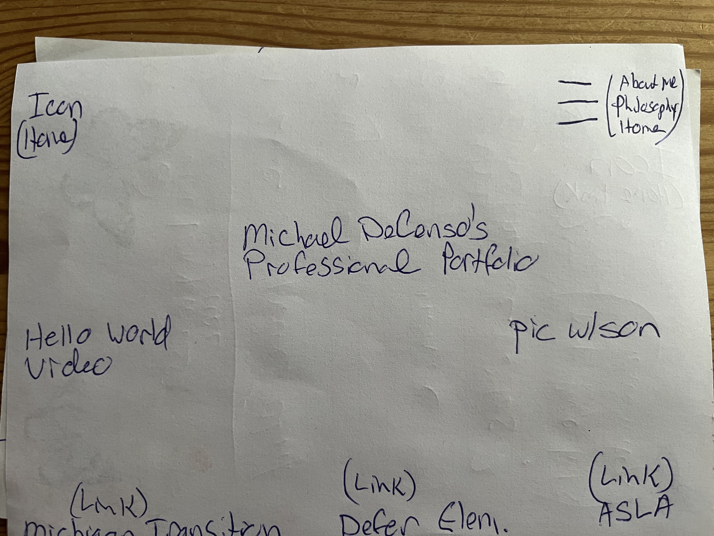
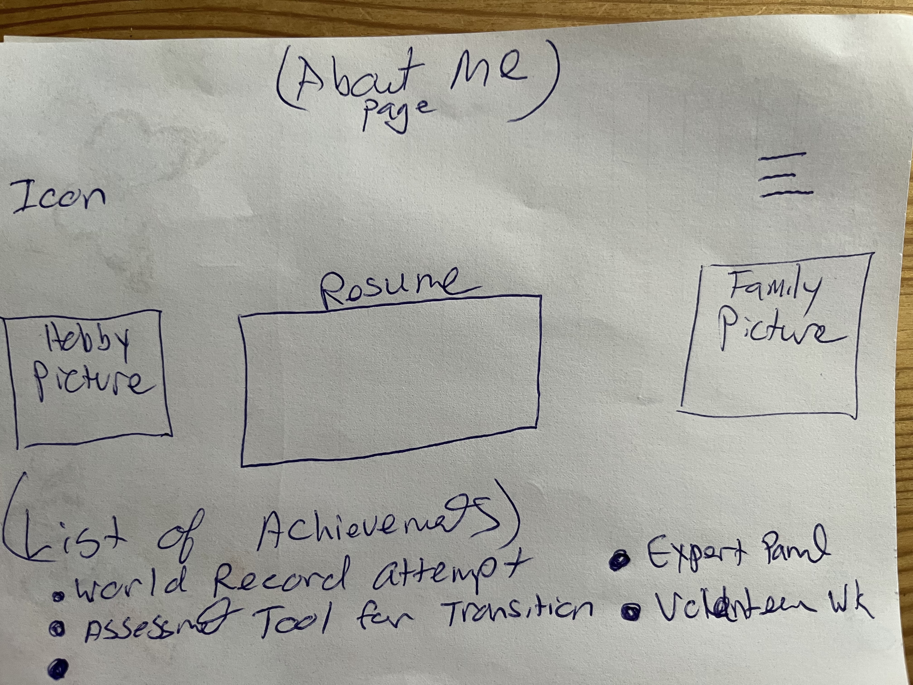
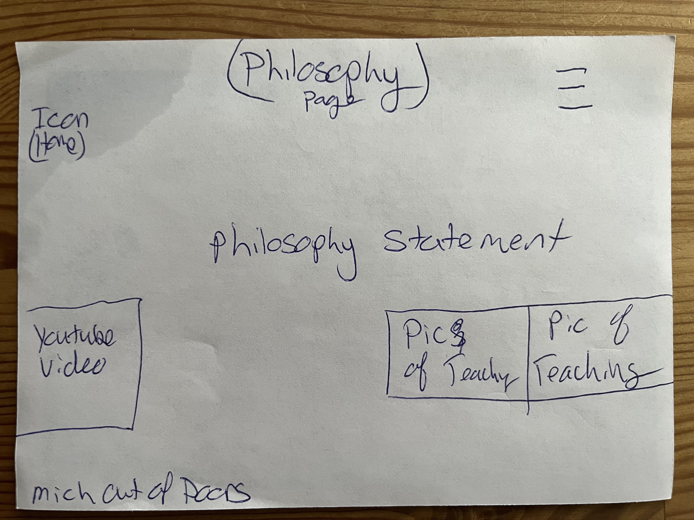

# Michael DeCenso's INF6420 Project
A portfolio site showcasing my work.
## wireframes

Homepage will have 3 sections, the sections will be a navigation menu, my name and credentials and a slide show of my professional work

About Me Page

This Aboutme page will display a link to my resume accomplishments and hobbies, navigation links and a bitmoji and link for my Defer school library space

Philosophy

This frame will contain a short statement in prose about my teaching philosophy and a navigation menu